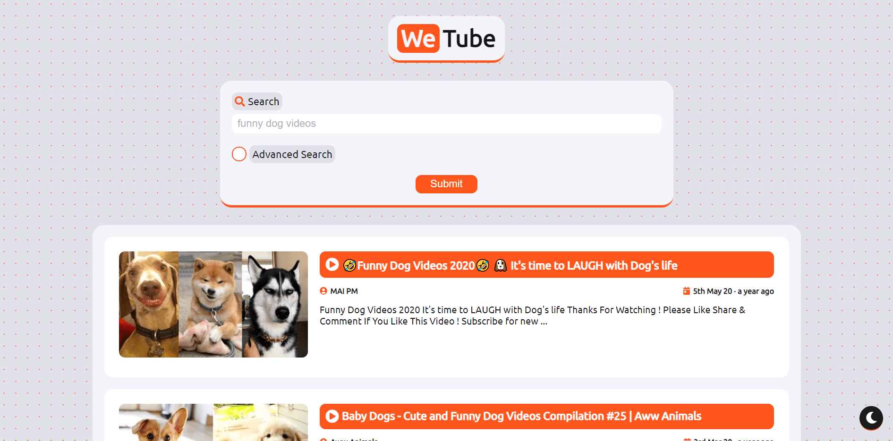
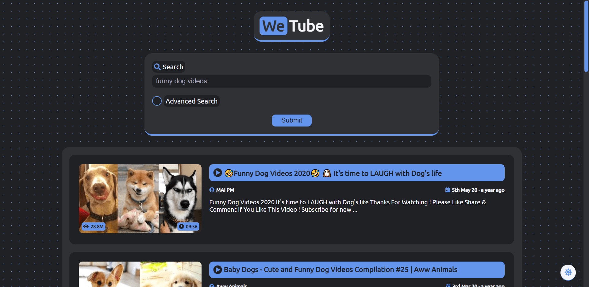
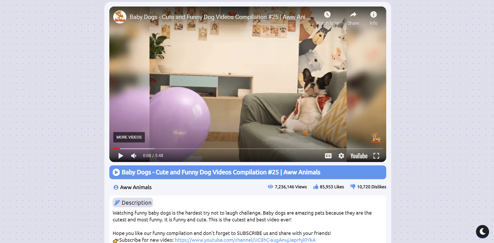
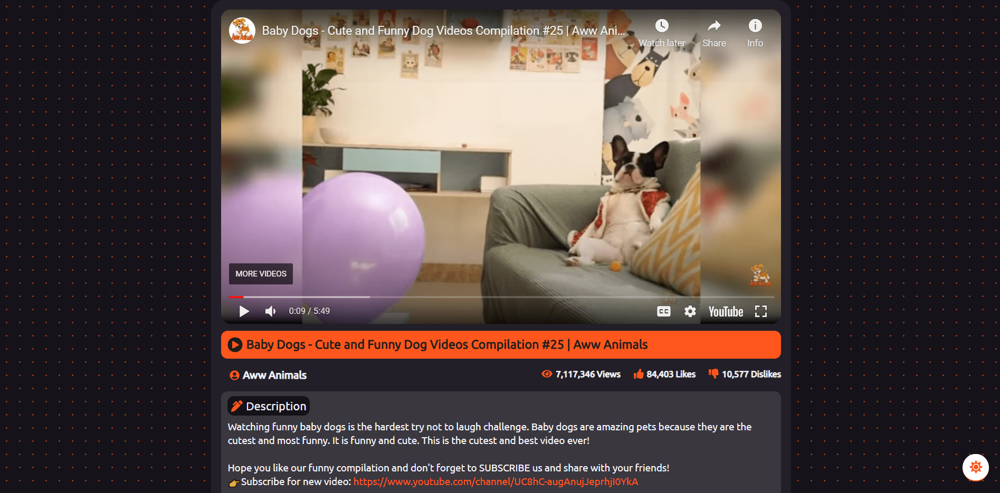

[

](https://sourhub226.github.io/wetube-react/)

 A YouTube like video streaming app built using ReactJS.

        
              
        
        
        

### Features:
- YouTube API allowing searching and playing videos directly from YouTube.
- Advanced search to filter search results by order, duration, etc.
- Dark mode to reduce eye strain while binge watching.

### App screenshots:
Light mode                                 |  Dark mode
:-----------------------------------------:|:------------------------------------------:
    |  
  |  

### Running the app: 
1. Clone the project repo

        git clone https://github.com/sourhub226/wetube-react.git
 
2. Move to root directory of the project 

        cd wetube-react
     
3. Obtain a developer key for YouTube API v3 from [here](https://developers.google.com/youtube/registering_an_application)
4. Create a `.env` file based on `.env.template` provided and put the above obtained key in it.  The contents of the `.env` file should look something like this:

        API_KEY=XXXXXXXXXXXXXXXXXXXXXXXX
        
5. Install all required npm packages

        npm install
    
6. Run the app

        npm run dev
